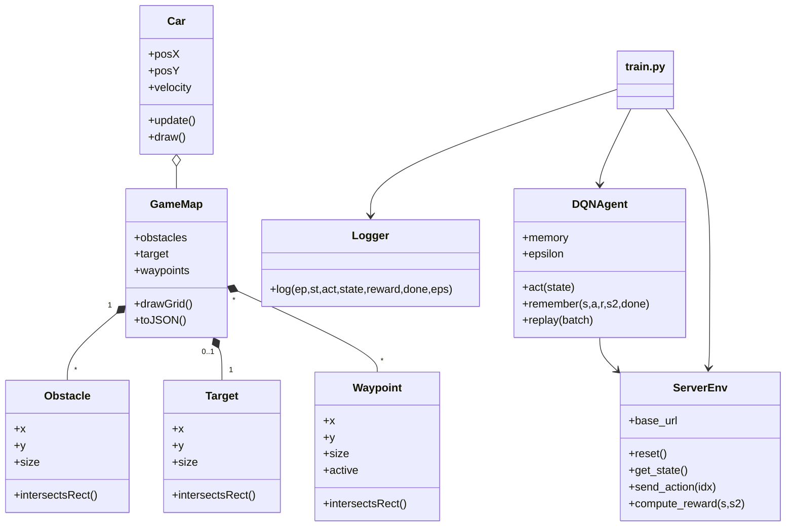

# Virtual Ares

Virtual Ares is a small browser based car simulator. It contains two main parts:

- **VE/** provides the Flask server and the JavaScript front end.
- **RL/** contains a simple reinforcement learning agent used for experiments with the simulator.

The HTML page `map2.html` loads the modules from `static/src` and renders a grid based map on which a car can drive. Obstacles, a target and optional waypoints can be placed on the map.

## Running the simulation

Install the Python dependencies and start the Flask server:

```bash
pip install -r requirements.txt
python VE/server.py
```

Open `http://127.0.0.1:5000/` in your browser. The following API endpoints are available:

- `/api/car` – read or send telemetry data
- `/api/control` – remote control commands
- `/api/grid` – current occupancy grid
- `/api/slam-map` – simplified SLAM map of the environment

The interactive map editor can be found at `http://127.0.0.1:5000/map2` and a
status page with the raw API output at `http://127.0.0.1:5000/status`.

## Reinforcement learning

The `RL` folder implements a small DQN agent that communicates with the running
Flask server. Start the server first and then run the training script:

```bash
cd RL
python train.py
```

Training progress is written to `rl_log.csv`. The agent itself is defined in
`Agent.py`, the environment wrapper in `environment.py` and logging is handled by
`logger.py`.

## Saving and loading maps

The control panel of `map2.html` contains buttons for working with maps. Maps
can be saved and loaded locally as JSON or CSV files. The previous server based
database for storing maps has been removed, so all map management now happens
through file download and upload only. When editing a map that was loaded from
the server's CSV list you can use the **CSV überschreiben** button to overwrite
the original file instead of downloading a new one.

## Command sequences

Sequences of actions can be stored under `static/sequences`. Each line of a
sequence normally consists of an action and a duration in seconds:

```text
forward,1
left,0.5
```

It is also possible to use conditional statements based on the sensor values.
An example line looks like this:

```text
if front < 50 then backward 1 else forward 1
```

The available sensor names are `front` (red LiDAR), `left`, `right` and `back`
(blue sonar). When running the sequence the condition is evaluated and the
corresponding branch is executed.

You can create such conditional sequences directly in the dashboard under
`/sequence`. Besides the normal **Schritt hinzufügen** button there is now a
**Bedingung hinzufügen** option which lets you pick a sensor, comparison and the
actions for the *then* and *else* branches.

You can also repeat actions multiple times using a simple `for` statement:

```text
for 3 forward 1
```

This executes the `forward` command three times for one second each. In the
sequence editor this can be added via the **Wiederholung hinzufügen** button.

Steps can be rearranged and nested via drag & drop. Simply drag an action or
condition onto the desired target list, e.g. into the *then* or *else* block or
inside a loop. Empty lists are shown with a dashed border to indicate that you
can drop items there.

The editor also supports **while** loops with sensor conditions. A loop will
continue executing its inner steps as long as the defined sensor comparison is
true (e.g. `while front > 20`). Sequences that contain such loops or other
conditional logic are stored in JSON format. When saving a sequence with loops,
the editor automatically selects JSON to avoid API errors.

Saved sequences can be reused inside new ones. When adding an "Ablauf einfügen"
block the editor stores only a reference to the selected sequence. During
execution the referenced file is loaded and its steps are executed. This allows
modularizing complex behaviours.

Existing sequences saved in JSON format can be loaded back into the editor
through the **Vorhanden** drop-down and the **Laden** button. This makes it
possible to edit and extend previously created command sequences.

Sequences saved as CSV or ROS files can also be loaded. When imported, they are
converted into simple action lists so they can be further adjusted and saved
again, e.g. in JSON format for advanced features.

## Class overview

The following Mermaid diagram illustrates the main classes in the repository and
their relationships:


